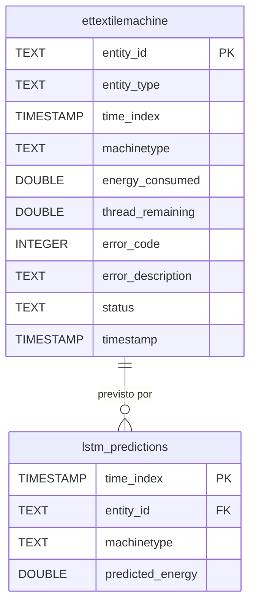

# Monitorização e Previsão de Dados IoT baseada em FIWARE
## Projeto 4 - Engenharia Informática

Sistema de monitorização em tempo real e previsão de consumo de máquinas têxteis, utilizando a plataforma FIWARE como base de dados de contexto e um modelo LSTM para previsão de dados futuros.

---

## Arquitetura

```
Agentes IoT (Python)
      │
      ▼
Orion Context Broker
      │                   │
      ▼                   ▼
QuantumLeap           MongoDB
      │
      ▼
CrateDB (Séries Temporais)
      │                   │
      ▼                   ▼
  Grafana            Modelo LSTM
(Dashboards)    (Previsões a cada 5 min)
```

---

## Stack Tecnológica

| Componente | Tecnologia | Porta |
|---|---|---|
| Context Broker | Orion (FIWARE) | 1026 |
| Base de Dados Orion | MongoDB | - |
| Persistência Timeseries | QuantumLeap | 8668 |
| Base de Dados Timeseries | CrateDB | 4200 / 6000 |
| Dashboard | Grafana | 3000 |
| Agente IoT | Python | - |
| Previsão | LSTM (TensorFlow/Keras) | - |

---

## Máquinas Simuladas

| ID | Nome | Tipo | Energia Base |
|---|---|---|---|
| TextileMachine:001 | Máquina A | Fiação | 5.2 kWh |
| TextileMachine:002 | Máquina B | Tecelagem | 4.8 kWh |
| TextileMachine:003 | Máquina C | Tingimento | 6.1 kWh |

### Dados monitorizados por máquina
- **energy_consumed** — Energia consumida por ciclo (kWh)
- **thread_remaining** — Fio restante na bobine (metros)
- **error_code** — Código de erro (0=OK, 101/202/303/404=erro)
- **error_description** — Descrição textual do erro
- **status** — Estado da máquina (running / error / warning)
- **machineType** — Tipo de máquina

### Erros por tipo de máquina

**Fiação:** Tensão de fio fora do intervalo, Quebra de fio detetada, Bobine quase vazia, Sensor de fio sem sinal

**Tecelagem:** Tear bloqueado, Tensão de trama incorreta, Fio de trama partido, Sensor de tear sem sinal

**Tingimento:** Temperatura do banho fora do intervalo, Nível de corante baixo, Bomba de circulação com falha, Sensor de temperatura sem sinal

---

## Pré-requisitos

- Docker Desktop instalado e a correr
- Git

---

## Como correr o projeto

### 1. Clonar o repositório
```bash
git clone https://github.com/joaojosesalgado123/PROJ4_Monitoriza-o-e-Previs-o-de-Dados-IoT-baseada-em-FiWare.git
cd PROJ4_Monitoriza-o-e-Previs-o-de-Dados-IoT-baseada-em-FiWare/Projeto4
```

### 2. Arrancar a stack completa
```bash
docker compose up -d --build
```

### 3. Verificar que está tudo a correr
```bash
docker logs -f iot-agent
```

---

## Aceder aos serviços

| Serviço | URL | Credenciais |
|---|---|---|
| Grafana | http://localhost:3000 | admin / admin |
| CrateDB UI | http://localhost:4200 | - |
| Orion API | http://localhost:1026 | - |
| QuantumLeap API | http://localhost:8668 | - |

---

## Verificar dados

### Entidades no Orion
```bash
curl -H "Fiware-Service: textile" \
     -H "Fiware-Servicepath: /factory" \
     "http://localhost:1026/v2/entities?type=TextileMachine"
```

### Histórico no QuantumLeap
```bash
curl -H "Fiware-Service: textile" \
     -H "Fiware-Servicepath: /factory" \
     "http://localhost:8668/v2/entities/urn:ngsi-ld:TextileMachine:001/attrs/energy_consumed?lastN=10"
```

### Dados no CrateDB
```sql
-- Dados em tempo real
SELECT * FROM mttextile.ettextilemachine ORDER BY time_index DESC LIMIT 20;

-- Previsões do LSTM
SELECT * FROM mttextile.lstm_predictions ORDER BY time_index DESC LIMIT 10;

-- Leituras por máquina e tipo
SELECT entity_id, machinetype, COUNT(*) as total
FROM mttextile.ettextilemachine
GROUP BY entity_id, machinetype;
```

---

## Modelo LSTM

O modelo LSTM (Long Short-Term Memory) é treinado automaticamente a cada 5 minutos com os dados históricos do CrateDB. Prevê o consumo de energia do próximo ciclo de cada máquina com base nas últimas 60 leituras (30 minutos de histórico).

**Nota:** O LSTM necessita de pelo menos 70 leituras por máquina para iniciar o treino. Com o intervalo padrão de 30 segundos, demora aproximadamente 35 minutos após o arranque.

As previsões são guardadas na tabela `mttextile.lstm_predictions` e visualizadas no painel **"Energia Real vs Prevista"** do Grafana.

---

## Parar o projeto

```bash
# Parar mantendo os dados
docker compose down

# Parar e apagar todos os dados
docker compose down -v
```

---

## Estrutura do projeto

```
Projeto4/
├── agent/
│   ├── agent.py              # Simulador IoT — 3 máquinas têxteis
│   ├── Dockerfile
│   └── requirements.txt
├── grafana/
│   ├── dashboards/
│   │   └── textile.json      # Dashboard exportado
│   └── provisioning/
│       ├── dashboards/
│       │   └── dashboards.yml
│       └── datasources/
│           └── crate.yml     # Ligação automática ao CrateDB
├── lstm/
│   ├── lstm.py               # Modelo LSTM de previsão
│   ├── Dockerfile
│   └── requirements.txt
├── docker-compose.yml
└── README.md
```

## Modelo de Dados

